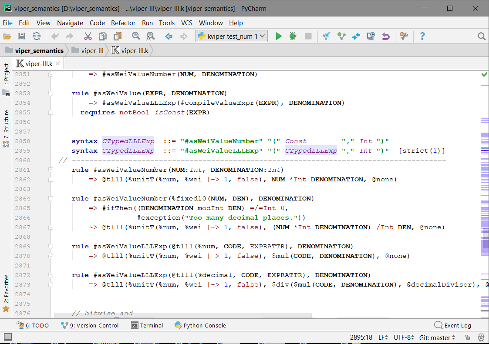

## Installation

Requirements:

- Intellij Idea 13

Installation instructions:

- Copy k-idea-plugin.jar to c:\Users\<user name>\.IdeaIC13\config\plugins or whatever.
- Restart Intellij Idea

## Features
All the features are similar with the corresponding features for Intellij Idea Java IDE. 

- Syntax highlighting of K files.
- Custom settings for syntax highlighting. go to Settings -> Editor -> Colors & Fonts -> K to change color settings.
- References for rule variables. A reference points at the first occurrence in the rule where variable is typed. To navigate from reference to the target Ctrl+click on the reference. 
- References for auxiliary functions. If the file don't contain "require" clauses and no other k file requires this one, then references are resolved locally. Otherwise they are resolved in the module scope. Both standard auxiliary functions and auxiliary functions defined as regular syntax (old style) are supported.
- References for KLabels. Both KLabels declared as such as well as KLabels of auxiliary functions.
- References for K sorts.
- Find usages for all the names that can be referenced. Right click on the name -> Find Usages.
- Rename variables/auxiliary functions. Right click on the name -> Refactor -> Rename.
- Folding of comments/rules/syntax. Multi-line comments are folded by default.
- Highlighting of open/closed parentheses pairs. Move the cursor over a parenthesis to see the effect.
- Quick navigation info for vars/functions. Keep Ctrl pressed and hover over a variable/aux function. Reference target should be displayed.
- Quick documentation view. Press Ctrl+Q on a reference. It will show the reference target plus the associated documentation.
  Supported targets are rule variables, auxiliary functions, sorts. The documentation view for auxiliary functions displays
  not only the syntax definition but also the rules implementing the particular function. The algorithm deciding which
  rules implement a particular function is a heuristic that relies, among others, on the rule name. Refer the source code for the precise algorithm.
- Find auxiliary function / KLabel / Sort. Press Ctrl+Alt+Shift+N. The list of all navigable symbols in the project is displayed. The list is narrowed as you type.
- Structure view for auxiliary functions. When the current file is a K file, press Ctrl+F12. The list of auxiliary functions in the file is displayed.
- Quick code commenting / uncommenting. Press Ctrl+/ to comment / uncomment the current line. Press Ctrl+Shift+/ to comment / uncomment the current selection.
- Code style: support for tab size only.
 
## Support for kompile / krun

- Go to Settings -> External Tools -> press "+"
	- Name: kompile
	- Program: kompile. On Windows: kompile.bat. Provided you already have k/bin in your $PATH.
	- Parameters: -v $FileName$
	- Working directory: $FileDir$
- Open a K file
- Right click -> kompile
- Go to Settings -> External Tools -> press "+"
	- Name: krun-simple
	- Program: krun. On Windows: krun.bat.
	- Parameters: $FileDir$/$FileName$
	- Working directory: <path to simple-untyped.k\>
- Open  a .simple file.
- Right click -> krun-simple

If you want to kompile/krun from run configurations, do the following:

- Install the plugin batch Script Support (Version 1.0.4 is patched by me to support Idea 13.)
- Edit configurations -> "+" -> Batch
	- Name: kompile
	- Script: leave empty
	- Before launch:
		- Remove "Make"
		- Add "Run external tool" -> kompile
- Now if you select this configuration and press "Run", the currently selected file will be kompiled.
- Similarly for krun

